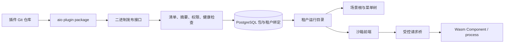

# aio-idea

这是基于 [aio-platform](https://github.com/zjarlin/aio-platform) 组装的应用产品和官方插件中心。系统引导能力来自 Cargo 中锁定完整提交 SHA 的独立插件仓库；`aio.toml` 定义默认租户首次启动时安装的运行时 Git 组合。活动版本、租户绑定、市场元数据和完整 `.aio-plugin` 二进制包保存在 PostgreSQL，本地版本目录只是可恢复的运行缓存。

开发者在本地完成构建与 `aio plugin package` 后，使用来源绑定凭证执行 `aio plugin publish` 直接上传二进制包。发布不依赖 GitHub Actions，不要求提交编译产物；验证与健康检查成功后在线激活，失败保留旧版本。成功发布的二进制包可以下载、在其他租户安装和回滚，无需回连 Git。当前动态目标为 PageDefinition、Wasm Component 和隔离 process；Dioxus 原生源码插件仍通过整体构建装配。

当前包协议为格式 2，CLI 与宿主使用同一固定提交的共享验证库。一个包可以同时包含 `plugin.frontend` 静态资源与 Wasm Component 或 process 后端。页面用 `PageDefinition.body.kind = frontend` 声明入口；宿主为当前用户、租户、页面和活动版本签发短期挂载票据，并在不含 `allow-same-origin` 的沙箱 iframe 中加载。浏览器请求只能经受控桥调用清单声明的后端路由，停用、卸载、回滚、切换租户或会话失效都会撤销旧票据。[Dioxus 全栈示例](https://github.com/zjarlin/aio-plugin-dioxus-fullstack) 已覆盖同仓前端、后端和共享模型。

插件开发先让 AI 阅读 aio-platform 仓库的 `aio-plugin-development` Skill 和对应语言规约。前端、后端、共享逻辑和子插件属于同一个功能仓库。

顶部场景选择当前菜单树的根，侧栏只显示当前场景的业务菜单。账户插件贡献的个人资料、设置、市场和租户切换页面从左下角进入独立全屏视图，点击“返回主后台”后保留原场景、页面及页面内部状态；账户页面不会重复出现在侧栏。此规则由共享壳处理，也适用于运行时子插件贡献的账户页面。

页面首次访问才挂载，菜单切换只隐藏旧页面。共享壳默认保留最近访问的 6 个后台页面和 2 个账户页面，不移动已挂载 iframe；缓存内切回会保留 Compose/JS 状态，无需重新申请票据或下载资源。超出容量淘汰非当前最久未访问页面，淘汰后重新打开仍是冷加载。目录每 30 秒以及窗口重新聚焦时刷新；版本、激活代次或页面权限变化会销毁对应缓存，会话、租户或用户权限变化会重建整个页面池。后端每次请求仍即时鉴权，前端目录刷新不是安全边界。

当前默认系统树由独立插件仓库共同贡献，目录节点本身不是业务页面：

```text
系统
├── 系统管理
│   ├── 用户管理        aio-plugin-rbac
│   ├── 角色管理        aio-plugin-rbac
│   └── 字典管理        aio-plugin-dictionary
└── 基础设施
    └── 文件管理
        └── 文件列表    aio-plugin-file
```

静态 Rust 系统插件以完整 Git SHA 锁定并通过 Dill `TypeId` 装配；在线插件则由数据库中的租户活动组合聚合。二者最终都转换为相同的场景、`menu_path` 和页面模型，壳不按标题硬编码目录。



```bash
git submodule update --init --recursive
dx serve
cargo run --no-default-features --features desktop
cargo run --no-default-features --features server
aio plugin install <git>
aio plugin sync
```

`lib/dioxus-admin-workbench` 以 Git 子模块锁定完整版本，Cargo patch 将产品和静态扩展的基础 UI crates 统一到该版本，避免同名不同源码依赖造成 Rust 类型不一致。它是基础库，不是运行时业务插件；CI、容器构建前必须初始化子模块。

252 生产发布使用 [发布脚本和服务单元](deploy/252/README.md)，由独立进程监督器管理隔离容器，Cloudflare Tunnel 或反向代理提供公网入口。`compose.yaml` 仅是应用容器构建入口，尚未装配监督器 socket、共享缓存和受限运行网络，不能单独作为完整插件宿主启动。
